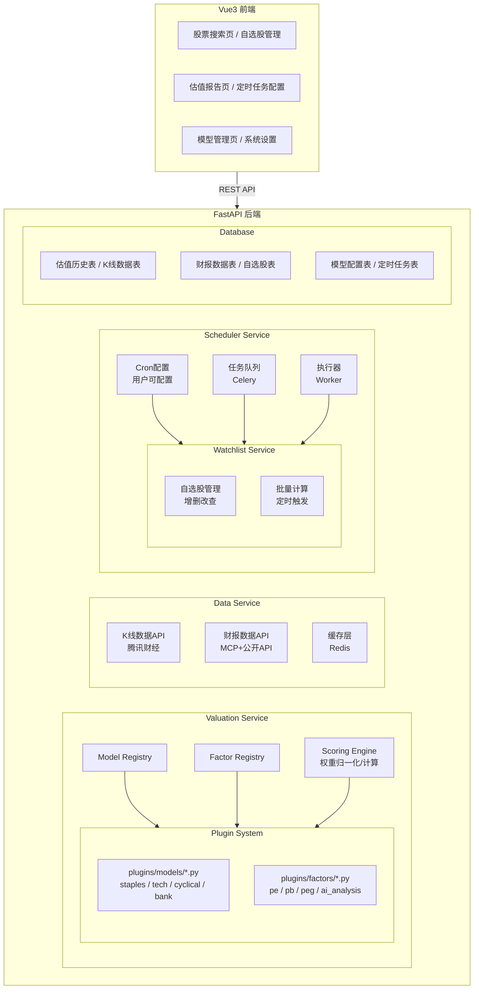
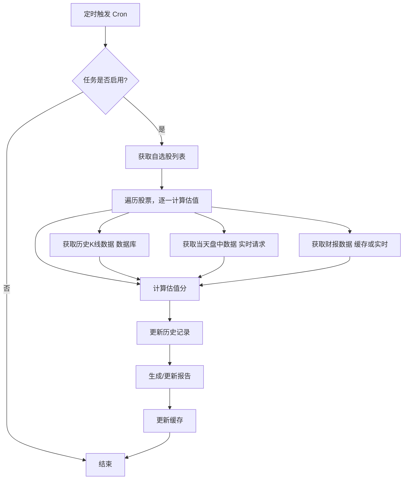
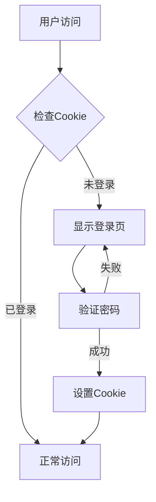

# 股票估值系统设计文档

## 1. 概述

### 1.1 项目背景

本系统是一个基于 Web 的股票估值分析平台，旨在为用户提供专业的股票估值分析服务。系统通过多种估值模型和因子，结合 AI 深度分析，为用户提供全面、准确的股票估值报告。

### 1.2 目标用户

个人投资者、股票分析师，需要对股票进行专业估值分析的用户。

### 1.3 核心价值

- 提供多维度、可定制的估值模型
- 支持 AI 深度分析作为可选因子
- 提供历史回测数据和交互图表
- 支持自选股管理和定时任务自动计算

---

## 2. 系统架构

### 2.1 整体架构



### 2.2 技术栈

| 层次 | 技术 | 版本 |
|------|------|------|
| 前端框架 | Vue3 | 3.4+ |
| 前端UI | Element Plus | 2.4+ |
| 图表库 | ECharts | 5.4+ |
| 后端框架 | FastAPI | 0.139+ |
| 数据库 | SQLite | 3.40+ |
| 缓存 | Redis | 7.0+ |
| 定时任务 | Celery + Beat | 5.3+ |
| 异步任务 | Celery | 5.3+ |

---

## 3. 核心功能模块

### 3.1 估值服务

#### 3.1.1 可插拔模型设计

**模型接口**：`plugins/models/base.py`

```python
class ValuationModel(ABC):
    @abstractmethod
    def get_name(self) -> str:
        pass
    
    @abstractmethod
    def get_code(self) -> str:
        pass
    
    @abstractmethod
    def get_factors(self) -> List[str]:
        pass
    
    @abstractmethod
    def get_weights(self) -> Dict[str, float]:
        pass
    
    @abstractmethod
    def get_params(self) -> Dict[str, float]:
        pass
```

**内置模型**：

| 模型代码 | 模型名称 | 适用行业 |
|----------|----------|----------|
| staples | 必选消费 | 食品饮料、医药、零售 |
| cyclical | 周期股 | 钢铁、煤炭、化工 |
| tech | 科技股 | 电子、通信、软件 |
| bank | 银行保险 | 银行、保险 |
| pharma | 医药股 | 医药制造、生物科技 |
| soe | 央企国企 | 央企、国企 |

#### 3.1.2 可插拔因子设计

**因子接口**：`plugins/factors/base.py`

```python
class ValuationFactor(ABC):
    @abstractmethod
    def get_name(self) -> str:
        pass
    
    @abstractmethod
    def get_code(self) -> str:
        pass
    
    @abstractmethod
    def score(self, data: Dict) -> float:
        pass
    
    @abstractmethod
    def requires_data(self) -> List[str]:
        pass
```

**内置因子**：

| 因子代码 | 因子名称 | 权重范围 | 需要数据 |
|----------|----------|----------|----------|
| pe | PE评分 | 15%-30% | kline, pe_range |
| pb | PB评分 | 10%-15% | kline, pb_range |
| peg | PEG评分 | 15%-30% | kline, eps_growth |
| ma_deviation | MA偏离度 | 10%-15% | kline |
| volatility | 波动率 | 8%-12% | kline |
| volume | 量能 | 8%-10% | kline |
| roe | ROE评分 | 10%-25% | financial |
| dividend | 股息率 | 10%-15% | financial |
| ai_analysis | AI深度分析 | 10%-15% | financial, market |

#### 3.1.3 AI分析因子

AI分析因子作为可选因子，权重建议10%-15%。

**AI分析维度**：
- 财报同比/环比变化分析
- 行业对比分析
- 市场环境分析
- 综合评价

**评分规则**：AI输出0-100分，参与加权计算。

#### 3.1.4 评分引擎

**权重归一化**：当某个因子数据缺失或用户选择不启用时，该因子被剔除，其余因子权重按比例重新分配。

**计算公式**：

```
综合估值分 = Σ(因子得分 × 因子权重)
其中：因子权重 = 原始权重 / Σ(有效因子原始权重)
```

### 3.2 数据服务

#### 3.2.1 K线数据

**存储策略**：
- 历史日K线：数据库持久化
- 当天盘中数据：实时请求

**更新方式**：
- 历史数据：定时任务增量更新（每日收盘后）
- 盘中数据：用户查询时即时获取

**数据来源**：腾讯财经API

#### 3.2.2 财报数据

**存储策略**：数据库缓存

**更新方式**：定时任务更新，频率可配置

**数据来源**：
- 优先：财务对比MCP工具
- 备用：新浪财经、东方财富公开API

#### 3.2.3 缓存策略

| 数据类型 | 缓存方式 | 过期时间 |
|----------|----------|----------|
| K线数据 | 数据库持久化 | 无（永久存储） |
| 财报数据 | 数据库缓存 | 可配置（默认7天） |
| 估值结果 | Redis缓存 | 当天有效 |
| AI分析结果 | Redis缓存 | 可配置（默认3天） |

### 3.3 自选股服务

#### 3.3.1 功能

- 添加/删除股票到自选列表
- 批量计算自选股估值
- 查看自选股估值状态

#### 3.3.2 数据模型

**watchlist 表**：

| 字段 | 类型 | 说明 |
|------|------|------|
| id | int | 主键 |
| stock_code | varchar(10) | 股票代码 |
| stock_name | varchar(50) | 股票名称 |
| industry | varchar(50) | 所属行业 |
| model_type | varchar(20) | 估值模型类型 |
| ai_enabled | bool | 是否启用AI分析 |
| created_at | datetime | 添加时间 |
| updated_at | datetime | 更新时间 |

### 3.4 定时任务服务

#### 3.4.1 功能

- 配置定时任务执行时间
- 支持多种定时类型（每小时/每天/每周）
- 自动触发自选股估值计算
- 手动触发计算

#### 3.4.2 数据模型

**scheduler_config 表**：

| 字段 | 类型 | 说明 |
|------|------|------|
| id | int | 主键 |
| schedule_type | varchar(20) | 定时类型（hourly/daily/weekly） |
| cron_expression | varchar(50) | Cron表达式 |
| enabled | bool | 是否启用 |
| include_ai | bool | 是否包含AI分析 |
| financial_update_frequency | int | 财报更新频率（天） |
| updated_at | datetime | 更新时间 |

#### 3.4.3 执行流程



### 3.5 用户认证

#### 3.5.1 认证方式

简单密码保护，单用户模式。

#### 3.5.2 认证流程



---

## 4. API 接口设计

### 4.1 认证接口

| 接口 | 方法 | 功能 |
|------|------|------|
| `/api/auth/login` | POST | 用户登录 |
| `/api/auth/logout` | POST | 用户登出 |
| `/api/auth/verify` | GET | 验证登录状态 |

### 4.2 股票接口

| 接口 | 方法 | 功能 |
|------|------|------|
| `/api/stock/search` | GET | 搜索股票 |
| `/api/stock/{code}` | GET | 获取股票基本信息 |
| `/api/stock/{code}/valuation` | GET | 获取估值报告 |
| `/api/stock/{code}/valuation` | POST | 计算估值（手动触发） |
| `/api/stock/{code}/history` | GET | 获取估值历史数据 |

### 4.3 自选股接口

| 接口 | 方法 | 功能 |
|------|------|------|
| `/api/watchlist` | GET | 获取自选股列表 |
| `/api/watchlist` | POST | 添加股票到自选 |
| `/api/watchlist/{code}` | DELETE | 从自选移除 |
| `/api/watchlist/batch` | POST | 批量计算自选股 |

### 4.4 定时任务接口

| 接口 | 方法 | 功能 |
|------|------|------|
| `/api/scheduler/config` | GET | 获取定时任务配置 |
| `/api/scheduler/config` | PUT | 更新定时任务配置 |
| `/api/scheduler/run` | POST | 手动触发一次计算 |

### 4.5 模型管理接口

| 接口 | 方法 | 功能 |
|------|------|------|
| `/api/models` | GET | 获取所有模型列表 |
| `/api/models/{code}` | GET | 获取模型详情 |
| `/api/factors` | GET | 获取所有因子列表 |
| `/api/factors/{code}` | GET | 获取因子详情 |

---

## 5. 前端页面设计

### 5.1 页面结构

| 页面 | 路径 | 功能 |
|------|------|------|
| 登录页 | `/login` | 用户登录 |
| 首页 | `/` | 自选股列表、快速搜索 |
| 估值报告页 | `/stock/{code}` | 估值报告展示、交互图表 |
| 模型管理页 | `/models` | 查看/配置估值模型和因子 |
| 定时任务配置页 | `/scheduler` | 配置定时任务参数 |
| 系统设置页 | `/settings` | 系统参数设置、财报更新频率 |

### 5.2 估值报告页

**核心功能**：
- 展示估值分和历史百分位
- 展示估值曲线（支持光标交互查看点位数据）
- 展示各因子得分详情
- 展示财报分析数据
- AI分析结果展示（如果启用）

**交互设计**：
- 鼠标悬停曲线显示详细数据
- 支持时间范围选择
- 支持数据导出（预留）

---

## 6. 数据库设计

### 6.1 表结构

**kline_data 表**（K线数据）：

| 字段 | 类型 | 说明 |
|------|------|------|
| id | int | 主键 |
| stock_code | varchar(10) | 股票代码 |
| date | date | 日期 |
| open | float | 开盘价 |
| high | float | 最高价 |
| low | float | 最低价 |
| close | float | 收盘价 |
| volume | int | 成交量 |
| amount | float | 成交额 |
| updated_at | datetime | 更新时间 |

**valuation_history 表**（估值历史）：

| 字段 | 类型 | 说明 |
|------|------|------|
| id | int | 主键 |
| stock_code | varchar(10) | 股票代码 |
| date | date | 日期 |
| score | float | 估值分 |
| pe_score | float | PE评分 |
| pb_score | float | PB评分 |
| peg_score | float | PEG评分 |
| ma_score | float | MA偏离评分 |
| volatility_score | float | 波动率评分 |
| volume_score | float | 量能评分 |
| roe_score | float | ROE评分 |
| dividend_score | float | 股息率评分 |
| ai_score | float | AI分析评分 |
| pe | float | PE值 |
| pb | float | PB值 |
| price | float | 收盘价 |
| updated_at | datetime | 更新时间 |

**financial_data 表**（财报数据）：

| 字段 | 类型 | 说明 |
|------|------|------|
| id | int | 主键 |
| stock_code | varchar(10) | 股票代码 |
| report_date | date | 报告日期 |
| eps | float | 每股收益 |
| revenue | float | 营业收入 |
| net_profit | float | 净利润 |
| roe | float | ROE |
| gross_margin | float | 毛利率 |
| dividend_rate | float | 股息率 |
| updated_at | datetime | 更新时间 |

**model_config 表**（模型配置）：

| 字段 | 类型 | 说明 |
|------|------|------|
| id | int | 主键 |
| model_code | varchar(20) | 模型代码 |
| model_name | varchar(50) | 模型名称 |
| factors | json | 因子列表 |
| weights | json | 因子权重 |
| params | json | 模型参数 |
| enabled | bool | 是否启用 |
| updated_at | datetime | 更新时间 |

---

## 7. 部署方案

### 7.1 本地开发

```bash
# 后端
cd backend
pip install -r requirements.txt
uvicorn app.main:app --reload

# 前端
cd frontend
npm install
npm run dev

# Redis
redis-server
```

### 7.2 生产部署

使用 Docker Compose 部署：

```yaml
version: '3.8'
services:
  backend:
    build: ./backend
    ports:
      - "8000:8000"
    environment:
      - REDIS_URL=redis://redis:6379
      - DATABASE_URL=sqlite:///./data/valuation.db
    volumes:
      - ./data:/app/data
  
  frontend:
    build: ./frontend
    ports:
      - "80:80"
  
  redis:
    image: redis:7.0
    volumes:
      - redis_data:/data
  
volumes:
  redis_data:
```

---

## 8. 安全考虑

### 8.1 认证安全

- 使用 JWT 或 Session Cookie 进行认证
- 密码存储使用 BCrypt 加密
- 设置合理的 Cookie 过期时间

### 8.2 API 安全

- 所有敏感接口需要认证
- 设置请求频率限制
- 输入参数校验

### 8.3 数据安全

- 数据库文件权限控制
- 敏感配置使用环境变量
- 定期备份数据库

---

## 9. 扩展计划

### 9.1 短期

- [ ] 核心估值服务实现
- [ ] 前端页面开发
- [ ] 自选股管理功能
- [ ] 定时任务功能

### 9.2 中期

- [ ] AI分析因子集成
- [ ] 财报数据自动获取
- [ ] 数据导出功能（预留）
- [ ] 多用户支持（预留）

### 9.3 长期

- [ ] 邮件通知功能
- [ ] 移动端适配
- [ ] 多语言支持
- [ ] 量化策略集成
